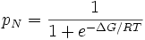
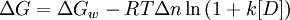

Previously, we have already discussed in details in experiment 8 the causes and the effects of "protein folding" and "protein denaturation", the denatured state and the mechanism behind the same. Continuing from where we had left our study with temperature related effects (thermal denaturation), now we look to extend our search further penetrating into the effects due to chemical denaturants in this experiment. So, without referring again the details of the earlier explained points we limit our discussion to focus in the perspective of the chemical denaturants and their contribution to our cause.  

**Protein Stability**  

To be biologically active, proteins must adopt specific folded three-dimensional, tertiary structures. Yet the genetic information for the protein specifies only the primary structure that is the linear sequence of amino acids in the polypeptide backbone. Many purified proteins can spontaneously refold in vitro after being completely unfolded, so the three-dimensional structure must be determined by the primary structure (Anfinsen, 1973). Different conformations of a protein differ only in the angle of rotation about the bonds of the backbone and amino acid side-chains. It may, therefore, appear surprising that a protein folds into a single unique conformation from all the possible rotational conformations available around single bonds in the primary structure of a protein. The question arises as to when a protein folds up to its native conformation, does this structure represent a local or a global energy minimum? The native structure of the protein may correspond to a metastable state with a very long lifetime. If proteins are only metastable, their structures must be grossly different from the most stable one. The polypeptide may adopt a structure corresponding to the global minimum.  

This led to the idea of a biased random search resulting in faster folding since a proportion of the conformations would be sterically disallowed. A framework model proposed (Baldwin, 1989; Kim and Baldwin, 1990) that the folded structure was formed by packing together pre-existing individual elements of secondary structure which had significant stability in the unfolded protein. It became evident through some experiments that the equilibrium of unfolding of proteins does not always follow a simple two-state model in which only the native and fully unfolded states are significantly populated (Wong and Tanford, 1973). An intermediate compact structure known as the molten globule which is different from the native structure and whose formation is determined mainly by non-specific interactions of amino acid residues with their environment was presented. Specific interactions could direct the folding pathway by stabilizing folded conformations. The best studied example is bovine pancreatic trypsin inhibitor (Creighton, 1978). For this protein it was shown that formation of a disulphide bridge stabilizes secondary structure elements, and the protein refolds by a specific pathway of disulphide bond formation and rearrangement (Directed folding model). **Since non covalent forces act on the primary structure to cause a protein to fold into a unique conformational structure and then stabilize the native structure against denaturation processes, it is of importance to understand the properties of these forces.**  

**Chemical Denaturation**  

Protein denaturation has been defined in several ways, for example as a change in solubility (Mirsky, 1941) or by simultaneous changes in **chemical**, physical and biological properties (Neurath et al., 1944; Langmuir, 1938) under some standard reference set of conditions (Timasheff and Gibbs, 1957).  

**The term chemical denaturation denotes the response of the native protein to acid, alkali, and a variety of other chemical agents which cause marked changes in the protein structure. Therefore chemical denaturation may be defined in very general terms as any modification of the secondary, tertiary or quaternary structure of the protein molecule, excluding any breaking of covalent bond (Joly, 1965).**  

Denaturation midpoint is defined as that denaturant concentration (Cm) at which both the folded and unfolded states of a protein are equally populated at equilibrium. It is usually determined by recording CD spectra of protein at various concentrations of the denaturant. The mid point of transition is taken as the point where 50% of the protein's secondary structure is in conformation 1 and the other 50% is in conformation 2.  

**Mathematical model behind chemical denaturation**

In the less expensive technique of equilibrium unfolding, the fractions of folded and unfolded molecules (denoted as pN and pU, respectively) are measured as the solution conditions are gradually changed from those favoring the native state to those favoring the unfolded state, e.g., by adding a denaturant such as guanidinium hydrochloride or urea. (In equilibrium folding, the reverse process is carried out.) Given that the fractions must sum to one and their ratio must be given by the Boltzmann factor, we have

  

  

Protein stabilities are typically found to vary linearly with the denaturant concentration. A number of models have been proposed to explain this observation prominent among them being the **denaturant binding model, solvent-exchange model** and the **Linear Energy Model (LEM)**. All of the models assume that only two thermodynamic states are populated/de-populated upon denaturation. They could be extended to interpret more complicated reaction schemes.

The denaturant binding model assumes that there are specific but independent sites on the protein molecule (folded or unfolded) to which the denaturant binds with an effective (average) binding constant k. The equilibrium shifts towards the unfolded state at high denaturant concentrations as it has more binding sites for the denaturant relative to the folded state (Δn). In other words, the increased number of potential sites exposed in the unfolded state is seen as the reason for denaturation transitions. An elementary treatment results in the following functional form:  

	         
    
where  ΔGw is the stability of the protein in water and [D] is the denaturant concentration. Thus the analysis of denaturation data with this model requires 7 parameters: ΔGw, Δn, k, and the slopes and intercepts of the folded and unfolded state baselines.

The solvent exchange model (also called the 'weak binding model' or 'selective solvation') of Schellman invokes the idea of an equilibrium between the water molecules bound to independent sites on protein and the denaturant molecules in solution. It has the form:

	    
    
where K is the equilibrium constant for the exchange reaction and Xd is the mole-fraction of the denaturant in solution. This model tries to answer the question of whether the denaturant molecules actually bind to the protein or they seem to be bound just because denaturants occupy about 20-30 % of the total solution volume at high concentrations used in experiments, i.e. non-specific effects - and hence the term 'weak binding'. As in the denaturant-binding model, fitting to this model also requires 7 parameters. One common theme obtained from both these models is that the binding constants (in the molar scale) for urea and guanidinium hydrochloride are small: ~ 0.2 M-1 for urea and 0.6M-1 for GuHCl.  

Intuitively, the difference in the number of binding sites between the folded and unfolded states is directly proportional to the differences in the accessible surface area. This forms the basis for the LEM which assumes a simple linear dependence of stability on the denaturant concentration. The resulting slope of the plot of stability versus the denaturant concentration is called the m-value. In pure mathematical terms, m-value is the derivative of the change in stabilization free energy upon the addition of denaturant. However, a strong correlation between the accessible surface area (ASA) exposed upon unfolding, i.e. difference in the ASA between the unfolded and folded state of the studied protein (dASA), and the m-value has been documented by Pace and co-workers. In view of this observation, the m-values are typically interpreted as being proportional to the dASA. There is no physical basis for the LEM and is purely empirical, though it is widely used in interpreting solvent-denaturation data. It has the general form:

	     	     

where the slope m is called the "m-value"(> 0 for the above definition) and [D]1/21/2 are two fitting parameters, along with four others for the linear baselines (slope and intercept for each line); in some cases, the slopes are assumed to be zero, giving four fitting parameters in total. The conformational stability  ΔG can be calculated for any denaturant concentration (including the stability at zero denaturant) from the fitted parameters m and [D]1/2. When combined with kinetic data on folding, the m-value can be used to roughly estimate the amount of buried hydrophobic surface in the folding transition state.  

**Chemical Denaturants**

Chemical Denaturants are classified into numerous categories:

 **- Acids**  

  Acidic protein denaturants include:  
    1. Acetic acid  
    2. Trichloroacetic acid 12% in water  
    3. Sulfosalicylic acid  
    4. Dichloroacetic acid  

 **- Solvents**  

  Most organic solvents are denaturing, including:
    1. Ethanol
    2. Methanol
    3. Formamide
    4. Dimethyl Formamide

 **- Cross-linking reagents**

  Cross-linking agents for proteins include:
    1. Formaldehyde
    2. Glutaraldehyde

 **- Chaotropic agents**  

  Chaotropic agents include:  
    1. Urea 6 - 8 mol/l  
    2. Guanidinium chloride 6 mol/l  
    3. Lithium perchlorate 4.5 mol/l  
    4. Sodium dodecyl sulphate  

 **- Disulfide bond reducers**  

  Agents that break disulfide bonds by reduction include:  
    1. 2-Mercaptoethanol  
    2. Dithiothreitol  
    3. TCEP (tris(2-carboxyethyl)phosphine)  

 **- Inorganic salts**  

  Lithium bromide, potassium thiocyanate, and sodium iodide.  

**The process of chemical denaturation of a protein:**

In chemical denaturation the secondary bonds holding the protein segments together are disrupted by some chemicals capable of forming equally strong or stronger bonds with the groups holding the conformation together. For disrupting the hydrogen bonds, urea or guanidine hydrochlorides are used. At high concentrations of these substances (e.g., 8M urea or 5M guanidine hydrochloride) many proteins adopt a highly unfolded conformation in solution. Proteins of multiple subunits are likely to be separated into their constituent polypeptide chains. Other proteins aggregate upon denaturation in urea or guanidine hydrochloride which is frequently due to the formation of disulphide bridges between sulphydryl groups made accessible by the unfolding of the polypeptide chains. Such reactions may be inhibited by the addition of iodoacetate (Friedli, PhD thesis, chapter 3 and 5). Under these conditions, the denatured molecules remain in solution and may revert into native molecules if the denaturing agent is slowly dialysed away. Powerful detergents like SDS disrupt both hydrophobic and hydrogen bonds and effectively solvate the denatured molecule. Beta-Mercaptoethanol and dithiothreitol (DTT) disrupt disulphide bonds and can be used in conjunction with urea or SDS to fully solubilize protein molecules.

Ref: The above picture is taken from the website of Department of Biology, Davidson College, Davidson, NC 28036

**An example of chemical denaturantion:**

Membrane proteins are not soluble. The first work on the folding of membrane proteins was carried out with bacteriorhodopsin (bR) which was successfully refolded into phospholipids via transfer into sodium dodecyl sulfate (SDS) micelles after denaturation by trifluoroacetic acid (TFA). This has established bR as a model system for studying the folding of helical membrane proteins. Kinetic studies of refolding of bR from an SDS-denatured state into lipid/detergent micelles have enabled detection of folding intermediates in its folding pathway.

Recently, studies with rhodopsin in phospholipid bicelles revealed a significant decrease of 50% of its helical content in the presence of urea, but it could not be refolded from such a largely unfolded state.

Different chemical denaturants like 4 M TFA, 8 M GuHCl, 10 M urea, 3% SDS + 8Murea, and 30% SDS have their effect on the secondary structure of Rhodopsin to different extents. Some of them cause aggregation in the unfolded structure. So to study the unfolded structure of Rhodopsin in the presence of chemical denaturants it is important to reinvestigate whether aggregation is taking place or not.

**Goal of The Experiment**

In this experiment we will see how different denaturing agents are effecting secondary structure of Rhodopsin differently and at the same time we will study the secondary structure of Rhodopsin as a function of the concentration of the denaturant.
